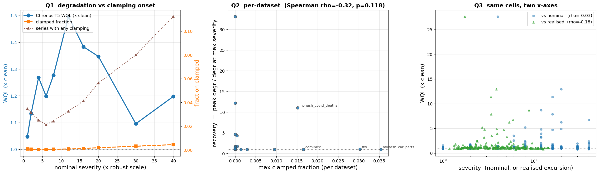

# E1 -- Clamping analysis (spikes_intensity, WQL)

Chronos-T5 = `amazon/chronos-t5-small`; value grid `[-15, +15]` over 4093 bins, 
clamp tokens 3 / 4095. 250 (dataset, severity) cells over 
25 datasets. Degradation is the sweep's own 
`WQL_degr` (per-dataset ratio to that model's clean score).

## Q1 - aggregate: does clamping switch on where the curve recovers?

|   severity |   degr_gmean |   clamped_frac |   series_any_clamped |   nominal_p99 |   realized_p99 |   scale_mean |
|-----------:|-------------:|---------------:|---------------------:|--------------:|---------------:|-------------:|
|          1 |       1.0475 |         0.0008 |               0.0348 |        2.7591 |         2.6569 |  1.60514e+06 |
|          2 |       1.134  |         0.0007 |               0.0316 |        2.7517 |         2.6795 |  1.57859e+06 |
|          4 |       1.2684 |         0.0006 |               0.0252 |        3.0077 |         2.9566 |  1.59801e+06 |
|          6 |       1.1991 |         0.0005 |               0.0212 |        3.4545 |         3.4105 |  1.66009e+06 |
|          8 |       1.2776 |         0.0006 |               0.0244 |        3.9711 |         3.9213 |  1.69256e+06 |
|         12 |       1.4965 |         0.0008 |               0.0328 |        4.8464 |         4.794  |  1.79555e+06 |
|         16 |       1.3833 |         0.0013 |               0.0412 |        5.6249 |         5.5488 |  1.82859e+06 |
|         20 |       1.3473 |         0.0019 |               0.0564 |        6.3196 |         6.2205 |  1.91091e+06 |
|         30 |       1.0958 |         0.0032 |               0.08   |        7.6852 |         7.5401 |  2.0672e+06  |
|         40 |       1.1974 |         0.0045 |               0.1124 |        8.7343 |         8.5115 |  2.2392e+06  |

## Q2 - per-dataset: do the datasets that clamp recover?

Spearman(max clamped fraction, recovery) **rho = -0.321**, 
p = 0.1178, n = 25 datasets. 
`recovery` = peak degradation / degradation at the largest severity; 
a value above 1 means the curve came back down after peaking.

| dataset                       |   n_series |   peak_degr |   peak_severity |   end_degr |   end_severity |   recovery |   max_clamped_frac |   max_any_clamped |   mad_over_meanabs |
|:------------------------------|-----------:|------------:|----------------:|-----------:|---------------:|-----------:|-------------------:|------------------:|-------------------:|
| monash_car_parts              |        100 |      1.0751 |              30 |     1.0651 |             40 |     1.0093 |             0.0354 |              0.71 |             0.3944 |
| m5                            |        100 |      1.1072 |               6 |     1.0294 |             40 |     1.0755 |             0.0303 |              0.78 |             0.4023 |
| dominick                      |        100 |      1.0898 |              20 |     1.0843 |             40 |     1.0051 |             0.0166 |              0.44 |             0.2898 |
| monash_covid_deaths           |        100 |      8.6739 |              12 |     0.7839 |             40 |    11.0653 |             0.0152 |              0.39 |             0.344  |
| monash_weather                |        100 |      1.0333 |               4 |     1.0148 |             40 |     1.0182 |             0.0095 |              0.25 |             0.2815 |
| monash_traffic                |        100 |      1.0125 |              20 |     1.006  |             40 |     1.0065 |             0.0029 |              0.14 |             0.3089 |
| m4_yearly                     |        100 |      1.8677 |              40 |     1.8677 |             40 |     1      |             0.0014 |              0.04 |             0.1894 |
| monash_fred_md                |        100 |      3.5336 |               6 |     2.0196 |             40 |     1.7496 |             0.0005 |              0.04 |             0.2381 |
| monash_tourism_yearly         |        100 |      6.2679 |              20 |     1.4622 |             40 |     4.2867 |             0.0004 |              0.01 |             0.1938 |
| monash_tourism_quarterly      |        100 |      1.5983 |               2 |     0.9875 |             40 |     1.6186 |             0.0001 |              0.01 |             0.2689 |
| monash_cif_2016               |         72 |     27.6471 |               4 |     0.8344 |             40 |    33.1332 |             0      |              0    |             0.158  |
| exchange_rate                 |          8 |     11.3829 |              16 |     6.7129 |             40 |     1.6957 |             0      |              0    |             0.1476 |
| m4_quarterly                  |        100 |      1.3468 |              12 |     1.0281 |             40 |     1.31   |             0      |              0    |             0.1939 |
| ercot                         |          8 |     12.926  |              20 |     1.0595 |             40 |    12.2002 |             0      |              0    |             0.1475 |
| monash_australian_electricity |          5 |      5.1821 |               8 |     1.1111 |             40 |     4.6638 |             0      |              0    |             0.1851 |
| monash_hospital               |        100 |      1.2495 |               4 |     0.9838 |             40 |     1.2701 |             0      |              0    |             0.1663 |
| monash_m1_monthly             |        100 |      1.1646 |               4 |     0.9807 |             40 |     1.1875 |             0      |              0    |             0.1573 |
| monash_m3_quarterly           |        100 |      1.5686 |              16 |     0.9946 |             40 |     1.5771 |             0      |              0    |             0.1377 |
| monash_m3_monthly             |        100 |      1.2259 |              20 |     1.0596 |             40 |     1.157  |             0      |              0    |             0.1662 |
| monash_m1_yearly              |        100 |      2.3829 |              40 |     2.3829 |             40 |     1      |             0      |              0    |             0.1383 |
| monash_m1_quarterly           |        100 |      1.1705 |              30 |     1.061  |             40 |     1.1032 |             0      |              0    |             0.1678 |
| monash_tourism_monthly        |        100 |      1.2139 |               4 |     0.994  |             40 |     1.2212 |             0      |              0    |             0.2767 |
| monash_nn5_weekly             |        100 |      1.0178 |               6 |     0.998  |             40 |     1.0199 |             0      |              0    |             0.1273 |
| monash_m3_yearly              |        100 |      1.6121 |              16 |     1.0486 |             40 |     1.5373 |             0      |              0    |             0.1472 |
| nn5                           |        100 |      1.0548 |               4 |     0.9627 |             40 |     1.0957 |             0      |              0    |             0.2309 |

## Q3 - same cells, two x-axes

- vs **nominal** severity: Spearman rho = -0.030 (p = 0.634)
- vs **realised** excursion: Spearman rho = -0.176 (p = 0.00525)

