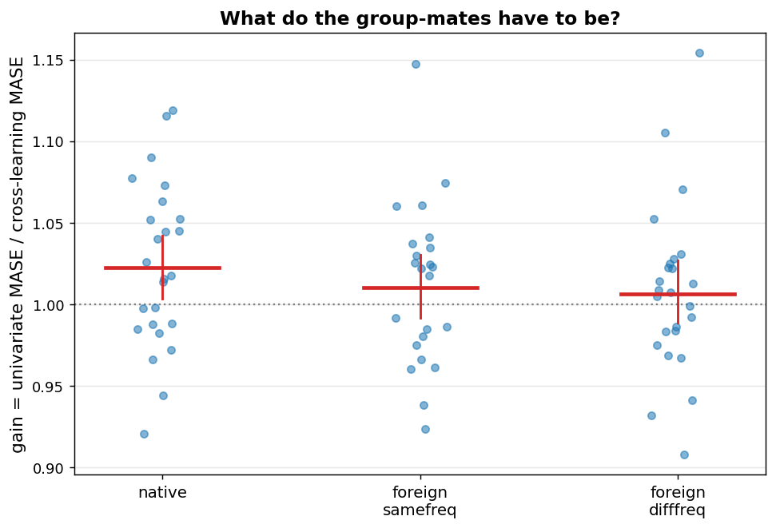

# E9 -- cross-learning sibling shuffle (MASE)

Gain = univariate MASE divided by cross-learning MASE; above 1 means grouping helped. Analysis unit is the dataset; CIs bootstrap the datasets (2000 draws); contrasts are paired Wilcoxon with Holm correction.

## Gain per sibling condition

| arm              |   n |   gain_gmean |   ci_lo |   ci_hi | datasets_helped   |   sign_p |
|:-----------------|----:|-------------:|--------:|--------:|:------------------|---------:|
| native           |  25 |       1.0223 |  1.0025 |  1.0429 | 15/25             |   0.2122 |
| foreign_samefreq |  23 |       1.0104 |  0.9919 |  1.0309 | 13/23             |   0.3388 |
| foreign_difffreq |  25 |       1.0066 |  0.9883 |  1.0268 | 14/25             |   0.345  |

## Paired contrasts

| contrast                             |   n |   median_diff |      p |   p_holm |
|:-------------------------------------|----:|--------------:|-------:|---------:|
| native vs foreign_samefreq           |  23 |        0.0108 | 0.2345 |   0.2345 |
| native vs foreign_difffreq           |  25 |        0.0129 | 0.0451 |   0.1354 |
| foreign_samefreq vs foreign_difffreq |  23 |        0.0075 | 0.0749 |   0.1497 |

## Datasets absent from arm A

Their same-frequency sibling pool held fewer than 99 series: `monash_australian_electricity`, `monash_traffic`.

## Verdict

native sufficient on its own: True; foreign same-frequency sufficient: False; foreign different-frequency sufficient: False; frequency matching contributes: same-freq > diff-freq, Holm p=0.15 (not significant)

