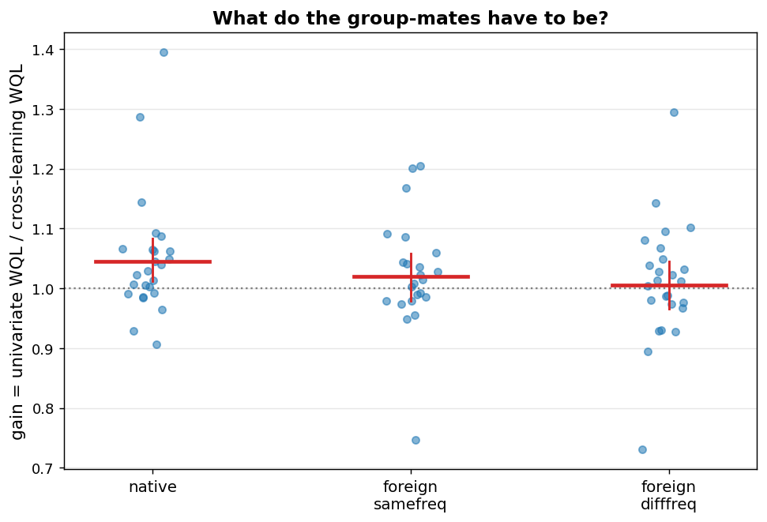

# E9 -- cross-learning sibling shuffle (WQL)

Gain = univariate WQL divided by cross-learning WQL; above 1 means grouping helped. Analysis unit is the dataset; CIs bootstrap the datasets (2000 draws); contrasts are paired Wilcoxon with Holm correction.

## Gain per sibling condition

| arm              |   n |   gain_gmean |   ci_lo |   ci_hi | datasets_helped   |   sign_p |
|:-----------------|----:|-------------:|--------:|--------:|:------------------|---------:|
| native           |  25 |       1.0448 |  1.0121 |  1.0852 | 18/25             |   0.0216 |
| foreign_samefreq |  23 |       1.02   |  0.9793 |  1.0576 | 14/23             |   0.2024 |
| foreign_difffreq |  25 |       1.0057 |  0.9659 |  1.0441 | 14/25             |   0.345  |

## Paired contrasts

| contrast                             |   n |   median_diff |      p |   p_holm |
|:-------------------------------------|----:|--------------:|-------:|---------:|
| native vs foreign_samefreq           |  23 |        0.0048 | 0.1695 |   0.1695 |
| native vs foreign_difffreq           |  25 |        0.0059 | 0.0667 |   0.1334 |
| foreign_samefreq vs foreign_difffreq |  23 |        0.0162 | 0.0101 |   0.0303 |

## Datasets absent from arm A

Their same-frequency sibling pool held fewer than 99 series: `monash_australian_electricity`, `monash_traffic`.

## Verdict

native sufficient on its own: True; foreign same-frequency sufficient: False; foreign different-frequency sufficient: False; frequency matching contributes: same-freq > diff-freq, Holm p=0.0303 (significant)

