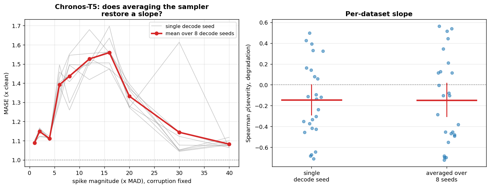

# E2a -- decode-only ablation (MASE)

The spike-magnitude sweep re-run under 8 decode seeds with the corruption held fixed at seed 0. Only `torch.manual_seed` moves, so this is a genuine single-variable manipulation of the model; the corrupted contexts were fingerprinted and verified byte-identical across runs.

## Q1 -- slope per decode seed

|   decode_seed |    mean |   median |    std |
|--------------:|--------:|---------:|-------:|
|             0 | -0.168  |  -0.2121 | 0.3848 |
|             1 | -0.1714 |  -0.2121 | 0.3674 |
|             2 | -0.1229 |  -0.2    | 0.3807 |
|             3 | -0.0807 |  -0.0788 | 0.3971 |
|             4 | -0.1016 |  -0.1515 | 0.4418 |
|             5 | -0.1908 |  -0.2242 | 0.4292 |
|             6 | -0.1922 |  -0.3697 | 0.4277 |
|             7 | -0.1413 |  -0.1636 | 0.3979 |

## Q2 -- slope after averaging the sampler down

- decode-averaged: rho = -0.1472 [-0.3106, +0.0327], positive on 9/25 datasets
- single decode seed: rho = -0.1461 [-0.2918, -0.0048], positive on 9/25
- paired change over 25 datasets: p = 0.6865

**DECODE IS EXCLUDED: the slope stays indistinguishable from zero once sampling noise is averaged down**

## Q3 -- sampler noise vs corruption placement

- median s.d. across decode seeds only: 0.0203
- median s.d. across corruption+decode seeds: 0.0463
- ratio: 0.569 (median over 250 cells)

The corruption-seed run supplies 3 seeds against 8 here, so treat this as an indicative decomposition rather than an exact variance split.

