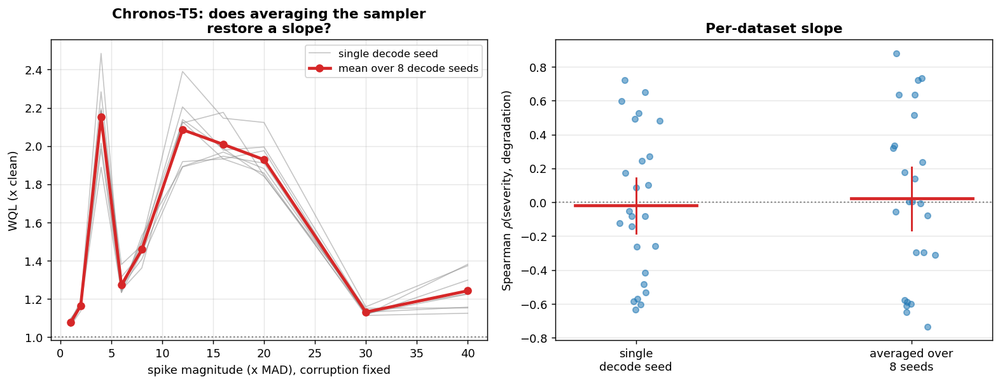

# E2a -- decode-only ablation (WQL)

The spike-magnitude sweep re-run under 8 decode seeds with the corruption held fixed at seed 0. Only `torch.manual_seed` moves, so this is a genuine single-variable manipulation of the model; the corrupted contexts were fingerprinted and verified byte-identical across runs.

## Q1 -- slope per decode seed

|   decode_seed |    mean |   median |    std |
|--------------:|--------:|---------:|-------:|
|             0 | -0.0148 |  -0.0182 | 0.495  |
|             1 | -0.0192 |  -0.1515 | 0.4863 |
|             2 |  0.0356 |   0.0182 | 0.478  |
|             3 |  0.0216 |   0.0182 | 0.4777 |
|             4 | -0.0124 |  -0.0909 | 0.4618 |
|             5 | -0.0182 |   0.0545 | 0.4554 |
|             6 | -0.0541 |   0.0061 | 0.4371 |
|             7 | -0.0919 |  -0.1273 | 0.4263 |

## Q2 -- slope after averaging the sampler down

- decode-averaged: rho = +0.0216 [-0.1676, +0.2146], positive on 13/25 datasets
- single decode seed: rho = -0.0192 [-0.1892, +0.1548], positive on 11/25
- paired change over 25 datasets: p = 0.05875

**DECODE IS EXCLUDED: the slope stays indistinguishable from zero once sampling noise is averaged down**

## Q3 -- sampler noise vs corruption placement

- median s.d. across decode seeds only: 0.0426
- median s.d. across corruption+decode seeds: 0.0650
- ratio: 0.712 (median over 250 cells)

The corruption-seed run supplies 3 seeds against 8 here, so treat this as an indicative decomposition rather than an exact variance split.

