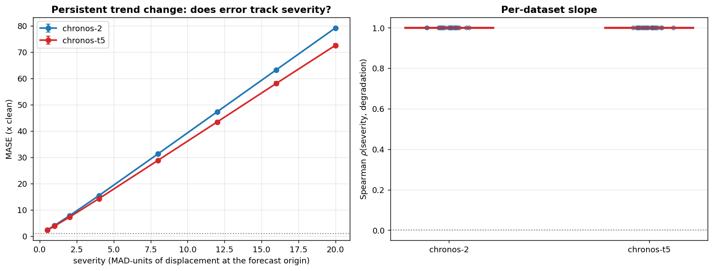

# E10 -- persistent trend change (high severity grid, MASE)

Source: `edge_case_regime.csv`, severities [np.float64(0.5), np.float64(1.0), np.float64(2.0), np.float64(4.0), np.float64(8.0), np.float64(12.0), np.float64(16.0), np.float64(20.0)].

`regime_trend` changes the trend in the last 25% of the context and keeps it changed through the forecast origin. Unlike the other six families it does not say "past observations are wrong" but "the process changed and is still in the new mode", which the model must judge rather than filter.

Analysis unit is the dataset (n = 25); seeds averaged within dataset before testing; CIs bootstrap the datasets (2000 draws).

## Q1 -- does the C1 split reappear?

| model      |   n |   mean_rho |   ci_lo |   ci_hi | datasets_positive   |
|:-----------|----:|-----------:|--------:|--------:|:--------------------|
| chronos-2  |  25 |          1 |       1 |       1 | 25/25               |
| chronos-t5 |  25 |          1 |       1 |       1 | 25/25               |

Paired Wilcoxon (Chronos-2 rho > Chronos-T5 rho), n = 25: not testable -- every per-dataset difference is exactly zero (both models saturate at rho = 1)

**C1 IS BOUNDED: Chronos-T5 does track severity on this family**

## Q2 -- matched against `drift` at equal origin displacement

Both families displace the final context point by the same amount at a given severity; they differ only in whether a breakpoint is present. Seed 0 only, because the seed-0 sweep is the only run containing `drift`.

| model      |   n |   drift_mean |   regime_mean |   diff |   ci_lo |   ci_hi |      p | severities         |
|:-----------|----:|-------------:|--------------:|-------:|--------:|--------:|-------:|:-------------------|
| chronos-2  |  25 |      29.9035 |       31.2814 | 1.3779 |  0.8616 |  1.9128 | 0      | 0.5,1,2,4,12,16,20 |
| chronos-t5 |  25 |      28.0844 |       28.6869 | 0.6025 |  0.2342 |  1.0006 | 0.0081 | 0.5,1,2,4,12,16,20 |

## Q3 -- absolute degradation by severity

|   severity |   chronos-2 |   chronos-t5 |
|-----------:|------------:|-------------:|
|        0.5 |      2.3537 |       2.2716 |
|        1   |      4.0615 |       3.8279 |
|        2   |      7.7166 |       7.1991 |
|        4   |     15.4176 |      14.2499 |
|        8   |     31.2906 |      28.8264 |
|       12   |     47.2703 |      43.4027 |
|       16   |     63.2184 |      58.0521 |
|       20   |     79.1553 |      72.5298 |

