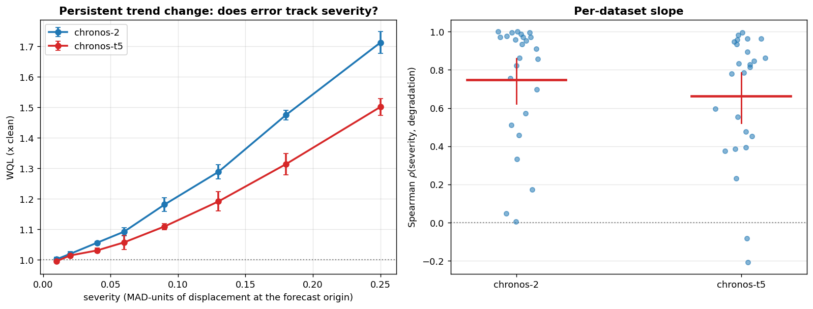

# E10 -- persistent trend change (low severity grid, WQL)

Source: `edge_case_regime_low.csv`, severities [np.float64(0.01), np.float64(0.02), np.float64(0.04), np.float64(0.06), np.float64(0.09), np.float64(0.13), np.float64(0.18), np.float64(0.25)].

`regime_trend` changes the trend in the last 25% of the context and keeps it changed through the forecast origin. Unlike the other six families it does not say "past observations are wrong" but "the process changed and is still in the new mode", which the model must judge rather than filter.

Analysis unit is the dataset (n = 25); seeds averaged within dataset before testing; CIs bootstrap the datasets (2000 draws).

## Q1 -- does the C1 split reappear?

| model      |   n |   mean_rho |   ci_lo |   ci_hi | datasets_positive   |
|:-----------|----:|-----------:|--------:|--------:|:--------------------|
| chronos-2  |  25 |     0.7486 |  0.6214 |  0.8605 | 25/25               |
| chronos-t5 |  25 |     0.6624 |  0.5267 |  0.7822 | 23/25               |

Paired Wilcoxon (Chronos-2 rho > Chronos-T5 rho), n = 25: p = 0.00445

**C1 IS BOUNDED: Chronos-T5 does track severity on this family**

## Q3 -- absolute degradation by severity

|   severity |   chronos-2 |   chronos-t5 |
|-----------:|------------:|-------------:|
|       0.01 |      1.0018 |       0.9956 |
|       0.02 |      1.0194 |       1.0142 |
|       0.04 |      1.056  |       1.0307 |
|       0.06 |      1.0922 |       1.0571 |
|       0.09 |      1.1812 |       1.1093 |
|       0.13 |      1.2885 |       1.1915 |
|       0.18 |      1.4748 |       1.3136 |
|       0.25 |      1.7122 |       1.5012 |

## Q4 -- effect-size-matched control

The first regime sweep started at 2.3x degradation while spike magnitude tops out at 1.5x, so a difference in slope was confounded with a difference in how damaging the corruption is. Here the regime sweep is restricted to severities [0.04, 0.06, 0.09, 0.13, 0.18], whose mean degradation falls inside the spike band, and both slopes are computed by the same code path on seeds 1-3.

| family                        | model      |   n |   mean_rho |   ci_lo |   ci_hi | datasets_positive   |
|:------------------------------|:-----------|----:|-----------:|--------:|--------:|:--------------------|
| regime_trend (effect-matched) | chronos-2  |  25 |     0.74   |  0.604  |  0.856  | 23/25               |
| regime_trend (effect-matched) | chronos-t5 |  25 |     0.5987 |  0.4667 |  0.7293 | 23/25               |
| spikes_intensity              | chronos-2  |  25 |     0.7797 |  0.6861 |  0.8579 | 25/25               |
| spikes_intensity              | chronos-t5 |  25 |    -0.1037 | -0.2493 |  0.0332 | 10/25               |

