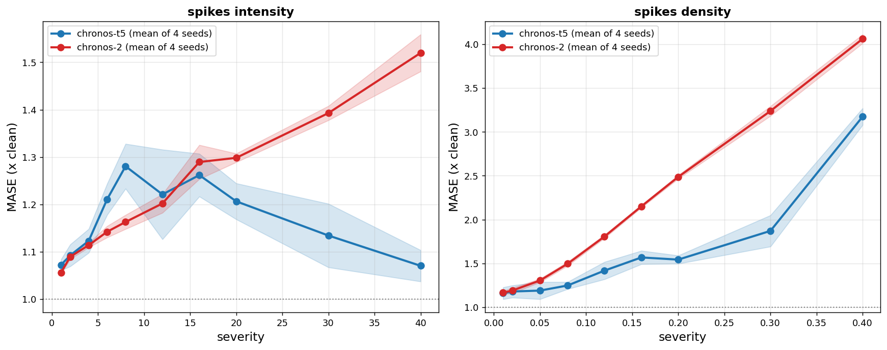

# E3 -- multi-seed replication (MASE)

Seeds [np.int64(0), np.int64(1), np.int64(2), np.int64(3)]; 25 datasets. Degradation is each (seed, model, dataset)'s metric divided by its own clean-context score, aggregated across datasets by geometric mean.

## A. Aggregate curve per seed (spikes_intensity)

### chronos-t5

|   severity |     0 |     1 |     2 |     3 |
|-----------:|------:|------:|------:|------:|
|          1 | 1.086 | 1.075 | 1.071 | 1.058 |
|          2 | 1.1   | 1.106 | 1.107 | 1.058 |
|          4 | 1.111 | 1.108 | 1.112 | 1.161 |
|          6 | 1.227 | 1.193 | 1.248 | 1.175 |
|          8 | 1.309 | 1.311 | 1.211 | 1.291 |
|         12 | 1.341 | 1.207 | 1.111 | 1.225 |
|         16 | 1.314 | 1.219 | 1.23  | 1.284 |
|         20 | 1.179 | 1.243 | 1.169 | 1.236 |
|         30 | 1.041 | 1.179 | 1.187 | 1.131 |
|         40 | 1.068 | 1.074 | 1.11  | 1.029 |

### chronos-2

|   severity |     0 |     1 |     2 |     3 |
|-----------:|------:|------:|------:|------:|
|          1 | 1.054 | 1.055 | 1.056 | 1.061 |
|          2 | 1.087 | 1.084 | 1.095 | 1.093 |
|          4 | 1.116 | 1.118 | 1.114 | 1.107 |
|          6 | 1.154 | 1.151 | 1.133 | 1.131 |
|          8 | 1.182 | 1.163 | 1.146 | 1.161 |
|         12 | 1.213 | 1.223 | 1.18  | 1.192 |
|         16 | 1.317 | 1.273 | 1.321 | 1.247 |
|         20 | 1.286 | 1.308 | 1.299 | 1.3   |
|         30 | 1.373 | 1.408 | 1.399 | 1.391 |
|         40 | 1.504 | 1.542 | 1.473 | 1.56  |

## B. Monotonicity per (seed, dataset) curve

Spearman rho of degradation against severity; +1 = perfectly monotone growth.

| model      |   mean |   median |    sd |   n |   frac_pos |
|:-----------|-------:|---------:|------:|----:|-----------:|
| chronos-2  |  0.828 |    0.855 | 0.14  | 100 |       1    |
| chronos-t5 | -0.123 |   -0.097 | 0.462 | 100 |       0.42 |

Chronos-2 curves are more monotone than Chronos-T5 curves: Mann-Whitney U = 9812, p = 3.15e-32.

## C. Held-out recovery test (seeds 1-3 only)

One-sided Wilcoxon: degradation at severity 12 greater than at 40. Severity 12 was located on seed 0, which is excluded here.

- **chronos-t5**: n = 75, median degradation 1.055 at sev 12 vs 1.023 at sev 40; W = 2013, p = 0.0009515
- **chronos-2**: n = 75, median degradation 1.141 at sev 12 vs 1.435 at sev 40; W = 70, p = 1

