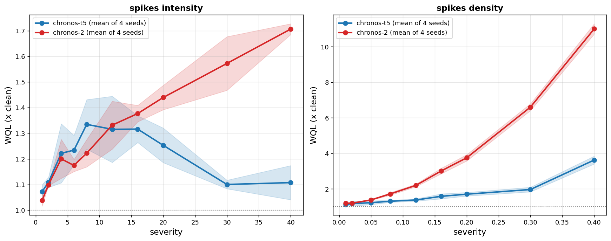

# E3 -- multi-seed replication (WQL)

Seeds [np.int64(0), np.int64(1), np.int64(2), np.int64(3)]; 25 datasets. Degradation is each (seed, model, dataset)'s metric divided by its own clean-context score, aggregated across datasets by geometric mean.

## A. Aggregate curve per seed (spikes_intensity)

### chronos-t5

|   severity |     0 |     1 |     2 |     3 |
|-----------:|------:|------:|------:|------:|
|          1 | 1.048 | 1.073 | 1.059 | 1.11  |
|          2 | 1.134 | 1.116 | 1.094 | 1.092 |
|          4 | 1.268 | 1.099 | 1.161 | 1.359 |
|          6 | 1.199 | 1.312 | 1.184 | 1.242 |
|          8 | 1.278 | 1.479 | 1.284 | 1.299 |
|         12 | 1.497 | 1.21  | 1.238 | 1.318 |
|         16 | 1.383 | 1.274 | 1.276 | 1.332 |
|         20 | 1.347 | 1.236 | 1.187 | 1.242 |
|         30 | 1.096 | 1.125 | 1.092 | 1.089 |
|         40 | 1.197 | 1.103 | 1.093 | 1.036 |

### chronos-2

|   severity |     0 |     1 |     2 |     3 |
|-----------:|------:|------:|------:|------:|
|          1 | 1.012 | 1.032 | 1.063 | 1.044 |
|          2 | 1.094 | 1.102 | 1.101 | 1.099 |
|          4 | 1.179 | 1.114 | 1.213 | 1.296 |
|          6 | 1.206 | 1.156 | 1.179 | 1.157 |
|          8 | 1.258 | 1.277 | 1.187 | 1.167 |
|         12 | 1.332 | 1.452 | 1.319 | 1.224 |
|         16 | 1.419 | 1.348 | 1.384 | 1.357 |
|         20 | 1.509 | 1.414 | 1.43  | 1.405 |
|         30 | 1.706 | 1.577 | 1.556 | 1.451 |
|         40 | 1.737 | 1.691 | 1.698 | 1.699 |

## B. Monotonicity per (seed, dataset) curve

Spearman rho of degradation against severity; +1 = perfectly monotone growth.

| model      |   mean |   median |    sd |   n |   frac_pos |
|:-----------|-------:|---------:|------:|----:|-----------:|
| chronos-2  |  0.796 |    0.879 | 0.24  | 100 |       0.98 |
| chronos-t5 | -0.081 |   -0.048 | 0.451 | 100 |       0.45 |

Chronos-2 curves are more monotone than Chronos-T5 curves: Mann-Whitney U = 9605, p = 1.12e-29.

## C. Held-out recovery test (seeds 1-3 only)

One-sided Wilcoxon: degradation at severity 12 greater than at 40. Severity 12 was located on seed 0, which is excluded here.

- **chronos-t5**: n = 75, median degradation 1.060 at sev 12 vs 1.031 at sev 40; W = 1888, p = 0.007245
- **chronos-2**: n = 75, median degradation 1.173 at sev 12 vs 1.554 at sev 40; W = 210, p = 1

